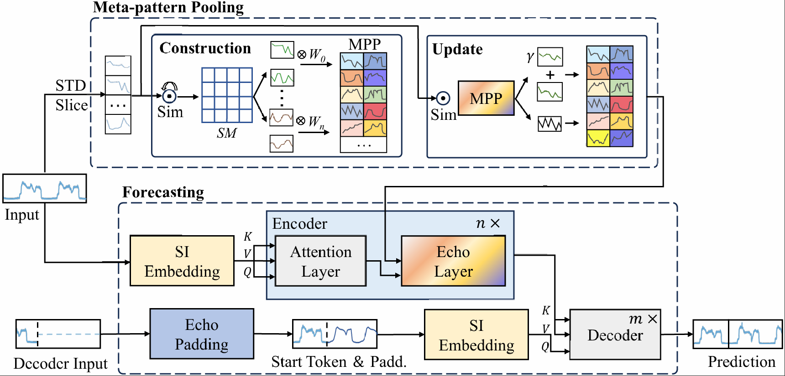

# MetaEformer: Unveiling and Leveraging Meta-patterns for Complex and Dynamic Systems Load Forecasting

This repo is the official Pytorch implementation of MetaEformer. 


## MetaEformer Framework

Framework overview of MetaEformer, consisting of two main parts: Meta-pattern Pooling and Forecasting.

## Augmented Dickey-Fuller (ADF) test
- In `math/ `, we provide code for conducting ADF tests on various datasets.


## Getting Started
### Environment Requirements

Install Python 3.8. For convenience, execute the following command.

```
pip install -r requirements.txt
```

### Data Preparation

You can obtain all the datasets in the `./dataset` directory.

**Note**: The `CBW.npy` file is quite large and is stored using Git LFS (Large File Storage). 

#### For new users:
```bash
# Install Git LFS
git lfs install

# Then clone the repository (LFS files will be downloaded automatically)
git clone <repository-url>

# Or if you already have the repository, pull LFS files
git lfs pull
```

#### For existing users:
If you already have Git LFS installed, `git clone` will automatically download LFS files. If you encounter issues with large files, run:
```bash
git lfs pull
```

### Training Example
- In `scripts/ `, we provide training scripts for different scenarios *Cloud/Power/Traffic*

For example:

To train the **MetaEformer** on **ECW dataset of Cloud**, you can use the scipt `scripts/ECW.sh`:
```
sh scripts/ECW.sh
```
It will start to train MetaEformer by default parameters.


